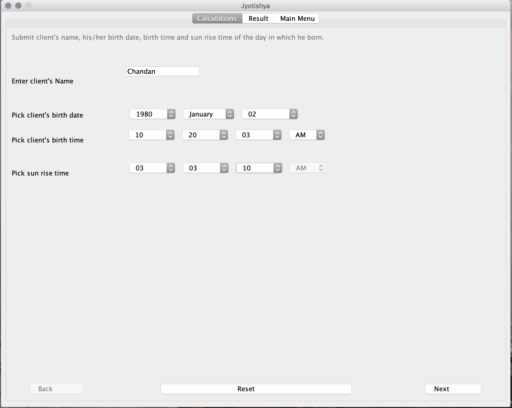
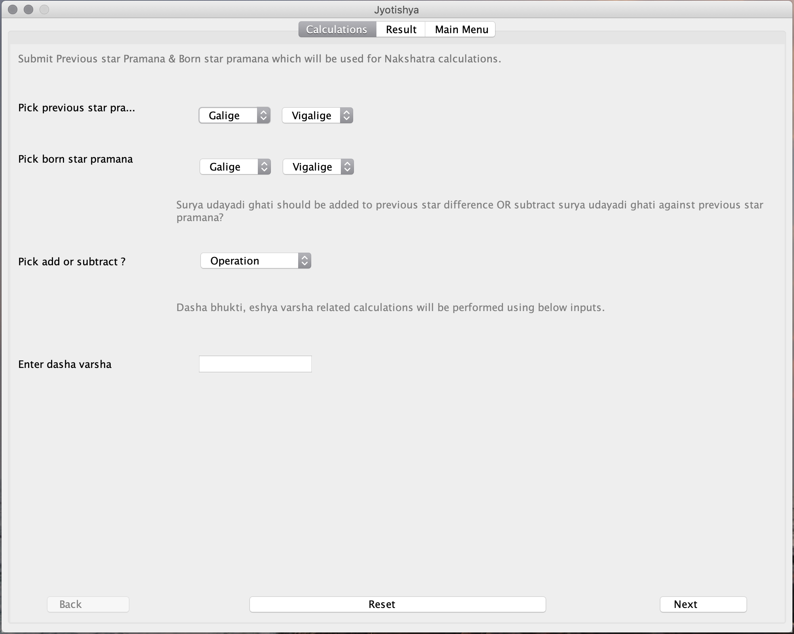
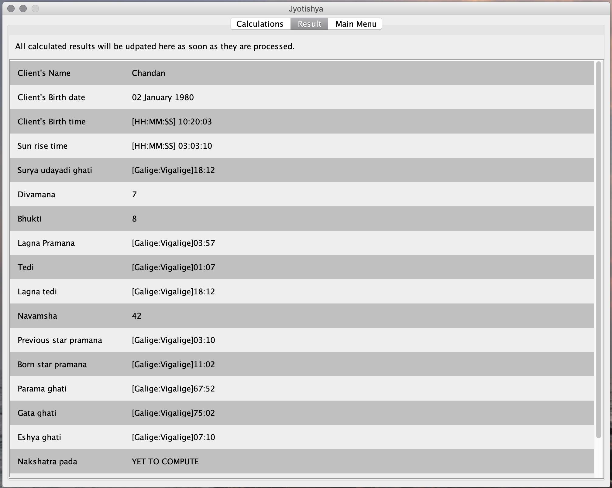

# JyotishyaDesktop

Jyotishya is a desktop application developed in java. This application performs  some basic calculations which is time consuming for  an astrologer. The calculations &amp; steps for the same, are used by  astrologers mostly from the regions-Shimoga,Kundapur etc of southern Karnataka.

#### [Check out setup guide..](../blob/master/Jyotishya/README.md)

------

## Sample screenshots:

### Screen: User inputs.

------
### Screen: Inputs for Nakshatra calculation.

------
### Screen: Sample results.

